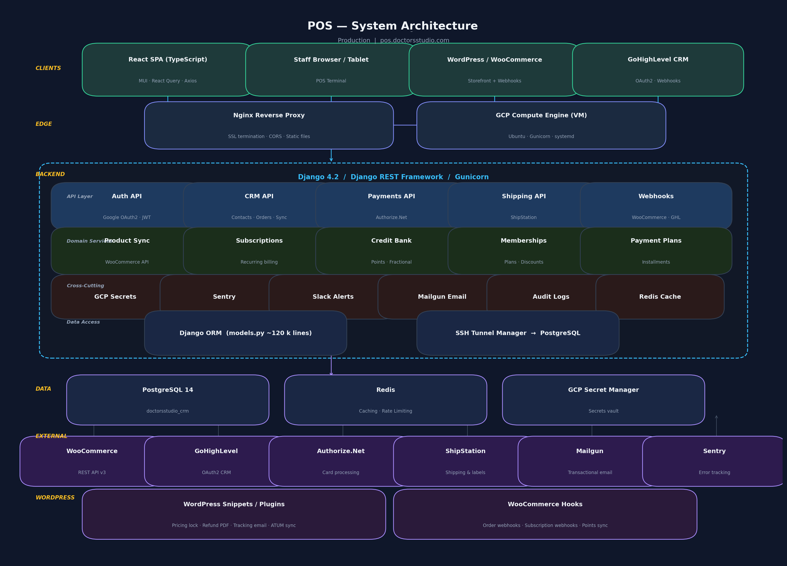
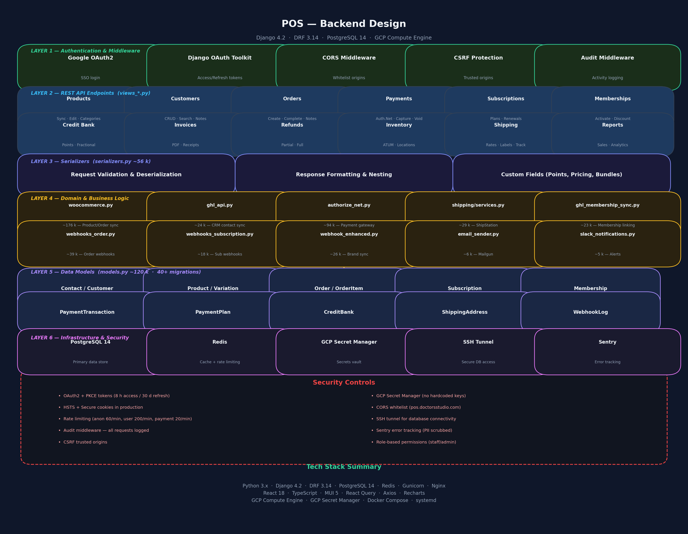

# POS — Project Overview

---

## 1. Introduction — What We Built

**POS** is a full-stack **Point of Sale and Practice Management System** purpose-built for a medical/aesthetic clinic (Doctors Studio, Boca Raton FL). It replaces fragmented manual workflows with a single unified platform that handles the entire patient-to-payment lifecycle.

### Core Capabilities

| Domain | What It Does |
|---|---|
| **Product & Inventory Management** | Two-way sync with WooCommerce (176 k lines of integration code). Products, variations, bundles, categories, and ATUM inventory locations stay in lock-step between the online store and the POS. |
| **Customer / Contact CRM** | Unified customer database synced bi-directionally with GoHighLevel CRM via OAuth2. Staff can search, create, and annotate customer records from a single view. |
| **Order Processing** | Full order lifecycle — cart → checkout → payment capture → completion → receipt PDF → email. Supports partial fulfillment, saved carts, and order notes. |
| **Payment Processing** | Authorize.Net integration (~94 k lines) for card-present and card-not-present transactions: authorize, capture, void, and refund. |
| **Subscription & Membership Management** | Create, renew, pause, cancel, and discount recurring subscriptions and membership plans. Deep WooCommerce Subscriptions + Memberships integration. |
| **Credit / Points Bank** | Fractional-point credit system that lets patients bank service credits purchased via bundles and redeem them at the POS. |
| **Payment Plans** | Installment scheduling with automatic Authorize.Net charges, receipts, and systemd-based cron for recurring billing. |
| **Shipping & Fulfillment** | ShipStation integration for rate quotes, label creation, and real-time shipment tracking with webhook-driven status updates. |
| **Invoicing & Receipts** | Server-side PDF generation (xhtml2pdf) for receipts, invoices, and refund documents — emailed via Mailgun. |
| **Reporting & Analytics** | Sales reports, service-type analytics, and dashboard charts powered by Recharts on the frontend. |
| **Webhook Engine** | Inbound webhooks from WooCommerce (orders, subscriptions, products) and GoHighLevel (contacts) with enhanced brand-sync and logging. |
| **WordPress Plugins** | 16 custom PHP snippets/plugins deployed on the WooCommerce site — pricing lock, refund-receipt PDF, tracking-email triggers, ATUM sync, and more. |

### Tech Stack at a Glance

- **Backend:** Python 3.x · Django 4.2 · Django REST Framework 3.14 · Gunicorn · Nginx
- **Frontend:** React 18 · TypeScript · Material UI 5 · React Query · Axios · Recharts
- **Database:** PostgreSQL 14 (SSH-tunnelled) · Redis (cache + rate-limiting)
- **Infrastructure:** GCP Compute Engine · GCP Secret Manager · Docker Compose · systemd services
- **Integrations:** WooCommerce REST API v3 · GoHighLevel OAuth2 · Authorize.Net · ShipStation · Mailgun · Sentry · Slack
- **Security:** OAuth2 + PKCE · Google SSO · HSTS · CORS whitelist · CSRF protection · Audit middleware · Rate limiting

The system runs in production at **pos.doctorsstudio.com** with a staging environment for pre-release testing.

---

## 2. Architecture & Backend Design Diagrams

Two high-resolution PNG diagrams have been generated in this directory:

### System Architecture


**File:** `docs/architecture_diagram.png`
Shows the end-to-end flow: Clients → Edge (Nginx / GCP VM) → Django Backend (API layer, domain services, cross-cutting concerns, data access) → Data stores (PostgreSQL, Redis, GCP Secrets) → External services (WooCommerce, GHL, Authorize.Net, ShipStation, Mailgun, Sentry) → WordPress plugin layer.

### Backend Design


**File:** `docs/backend_design.png`
Shows the six-layer backend architecture:
1. **Authentication & Middleware** — Google OAuth2, Django OAuth Toolkit (PKCE), CORS, CSRF, Audit
2. **REST API Endpoints** — 12+ view modules covering products, customers, orders, payments, subscriptions, memberships, credit bank, invoices, refunds, inventory, shipping, reports
3. **Serializers** — Request validation, response formatting, custom fields (~56 k lines)
4. **Domain & Business Logic** — WooCommerce sync, GHL API, Authorize.Net, ShipStation, webhooks, email, Slack
5. **Data Models** — 40+ migrations, 10+ core models (~120 k lines)
6. **Infrastructure & Security** — PostgreSQL, Redis, GCP Secret Manager, SSH tunnel, Sentry, full security controls

---

## 3. Designing a Secure API for Patient Data (App ↔ AWS Backend)

> Below is a concise design brief for building a **HIPAA-aligned** REST/GraphQL API that securely transports Protected Health Information (PHI) between a mobile/web app and an AWS-hosted backend.

### 3.1 Authentication & Authorization

| Concern | Recommendation |
|---|---|
| **Identity Provider** | AWS Cognito User Pool (or Auth0) — handles sign-up, MFA, and JWT issuance. |
| **Token Strategy** | Short-lived access tokens (15–30 min) + rotating refresh tokens. Store tokens in secure HTTP-only cookies (web) or the OS keychain (mobile). |
| **Authorization** | Role-based (RBAC) with fine-grained scopes: `patient:read`, `patient:write`, `admin:*`. Enforce at the API Gateway **and** application layer. |
| **MFA** | Mandatory for staff/admin roles; recommended for patients. Cognito supports TOTP and SMS. |

### 3.2 Transport Security

- **TLS 1.2+ everywhere** — enforce via AWS ALB or API Gateway with a managed ACM certificate.
- **Certificate pinning** on native mobile clients to prevent MITM.
- **HSTS headers** with `max-age ≥ 1 year`, `includeSubDomains`, and `preload`.

### 3.3 Data Encryption

| Layer | Mechanism |
|---|---|
| **In transit** | TLS 1.2/1.3 (ALB / API Gateway termination) |
| **At rest — database** | AWS RDS with AES-256 encryption enabled (uses KMS CMK) |
| **At rest — files/blobs** | S3 with SSE-KMS and bucket policies denying unencrypted uploads |
| **Application-level** | Encrypt PHI fields (SSN, DOB, diagnosis) at the app layer with a dedicated KMS data-encryption key before writing to the DB. This adds defence-in-depth beyond disk encryption. |

### 3.4 API Gateway & Network

```
  Mobile/Web App
       │  HTTPS
       ▼
  ┌──────────────────┐
  │  AWS API Gateway  │  ← WAF rules, throttling, JWT authorizer
  └────────┬─────────┘
           │  VPC Link (private)
           ▼
  ┌──────────────────┐
  │  ALB (internal)  │  ← health checks, sticky sessions
  └────────┬─────────┘
           │
           ▼
  ┌──────────────────┐
  │  ECS / Lambda    │  ← app containers in private subnets
  └────────┬─────────┘
           │
           ▼
  ┌──────────────────┐
  │  RDS (PostgreSQL) │  ← private subnet, no public IP
  └──────────────────┘
```

- **Private subnets only** for compute and database — no public IPs.
- **Security groups**: allow only ALB → ECS on app port; ECS → RDS on 5432.
- **AWS WAF** on API Gateway: rate-limit, geo-block, SQL-injection & XSS rule sets.
- **VPC endpoints** for S3, Secrets Manager, KMS — traffic never leaves AWS backbone.

### 3.5 Secrets Management

- **AWS Secrets Manager** for DB credentials, API keys, encryption keys — automatic rotation every 30–90 days.
- **No hardcoded secrets** — inject via environment variables from ECS task definitions referencing Secrets Manager ARNs.
- **KMS CMK** for all encryption operations; key policy restricts to specific IAM roles.

### 3.6 Audit & Compliance

| Control | Implementation |
|---|---|
| **Access logging** | API Gateway access logs → CloudWatch; ALB access logs → S3 |
| **Audit trail** | Every PHI read/write logged with user ID, timestamp, resource, and action → DynamoDB or CloudWatch Logs with 6-year retention (HIPAA) |
| **CloudTrail** | Enabled for all regions — captures every AWS API call |
| **Alerting** | CloudWatch Alarms + SNS for anomalous access patterns, 4xx/5xx spikes |
| **Penetration testing** | Annual third-party pen test; quarterly automated scans (AWS Inspector) |

### 3.7 HIPAA-Specific Safeguards

1. **BAA** — Sign an AWS Business Associate Agreement (prerequisite for any PHI on AWS).
2. **Minimum Necessary** — API responses return only the fields the caller's role requires (field-level projection).
3. **Break-the-glass** — Emergency override for providers; logged and alerted separately.
4. **Patient consent** — API enforces consent flags before disclosing sensitive records.
5. **Data retention & disposal** — Automated lifecycle policies: archive after N years → Glacier → hard-delete per retention schedule.

### 3.8 API Design Principles

- **Versioned endpoints** (`/v1/patients/{id}`) — never break existing clients.
- **Input validation** — strict schema validation (JSON Schema / Pydantic / Zod) at the gateway and application layer.
- **Rate limiting** — per-user and per-IP; tighter limits on write endpoints.
- **Idempotency keys** — for POST/PUT to prevent duplicate records from retries.
- **Error responses** — never leak stack traces or internal IDs; return generic error codes with a correlation ID for backend tracing.

### 3.9 Summary Diagram (Conceptual)

```
┌─────────────┐    HTTPS/TLS 1.3    ┌───────────────────────────────────────┐
│  Mobile App  │ ──────────────────► │         AWS API Gateway               │
│  (Keychain)  │    + JWT Bearer     │  WAF │ Throttle │ JWT Authorizer      │
└─────────────┘                      └───────────────┬───────────────────────┘
                                                     │ VPC Link
                                                     ▼
                                     ┌───────────────────────────────────────┐
                                     │  Private Subnet                       │
                                     │  ┌─────────┐   ┌──────────────────┐  │
                                     │  │ ECS/    │──►│ RDS (encrypted)  │  │
                                     │  │ Lambda  │   │ PostgreSQL       │  │
                                     │  └────┬────┘   └──────────────────┘  │
                                     │       │                               │
                                     │  ┌────▼────────────────────────────┐  │
                                     │  │ Secrets Mgr │ KMS │ CloudWatch │  │
                                     │  └─────────────────────────────────┘  │
                                     └───────────────────────────────────────┘
```

> **Key takeaway:** Layer your defences — authentication at the edge, encryption at every tier, least-privilege networking, comprehensive audit logging, and HIPAA-specific administrative controls. No single layer is sufficient on its own.

